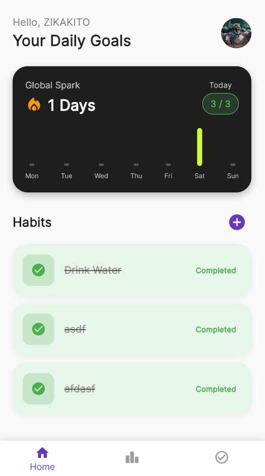
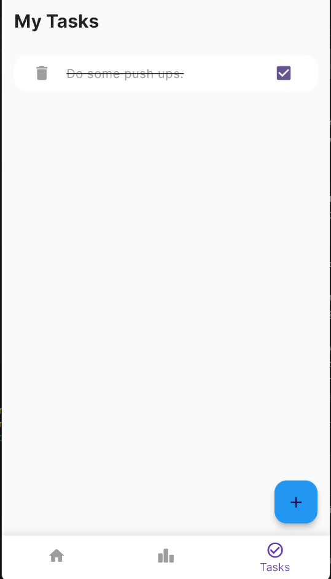
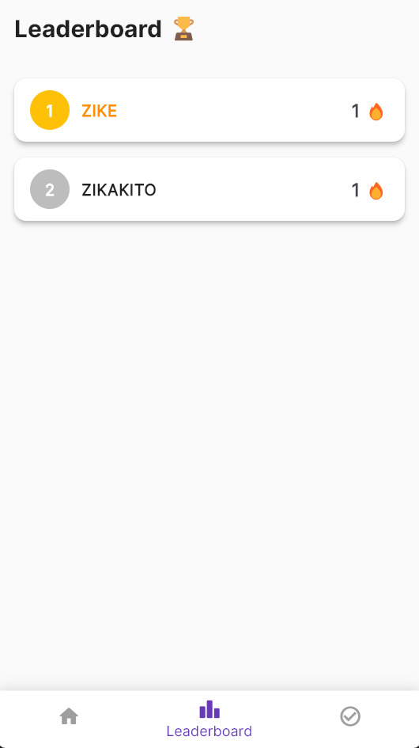
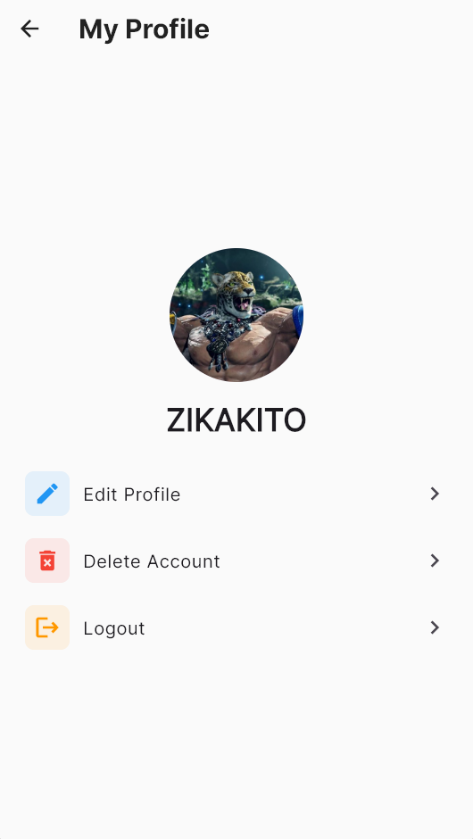

# Habit Tracker

**Habit Tracker** is a gamified productivity application designed to help you build and maintain good habits through a unique "Global Spark" streak system. Unlike traditional habit trackers, Habit Tracker encourages overall consistency by rewarding you for completing a minimum number of tasks each day.

## Key Features

### 🔥 Global Spark System

The core mechanic of Habit Tracker. Instead of tracking streaks for individual habits, you build a **Global Streak**.

- **Rule**: Complete at least **3 habits** in a day to keep your streak alive.
- **Goal**: This prevents "streak fatigue" where missing one specific habit breaks your flow. As long as you are productive overall, your progress counts!

### 📊 Gamified Statistics

Visual feedback on your daily and weekly progress.

- **Daily Goals**: See exactly how many more habits you need to hit your daily target.
- **Weekly Consistency**: A bar chart visualizes your activity over the last 7 days.

### 🏆 Leaderboard

Compete with others!

- See where you stand against other users based on your Global Streak.
- Stay motivated by climbing the ranks.

### 🔐 Secure & Cloud-Synced

- **Authentication**: Secure Signup/Login using JWT and Bcrypt.
- **Cloud Storage**: All your data (habits, streaks, profile) is safely stored in the cloud (Firebase Firestore), so you can access it from any device.

---

## Screenshots

### Home Screen

Your dashboard. View your Global Spark, daily progress, and manage your habits.


### Tasks & Habits

Manage your daily checklist. Mark items as done to contribute to your daily score.


### Leaderboard

See how you stack up against the competition.


### Profile

Manage your account, update your avatar, and see your personal details.


---

## Tech Stack

- **Frontend**: Flutter (Dart) - Cross-platform mobile/desktop app.
- **Backend**: Node.js & Express - RESTful API.
- **Database**: Firebase Firestore - NoSQL cloud database.
- **Authentication**: Custom JWT implementation with `google-auth-library` and `bcrypt`.

## Getting Started

### Prerequisites

- Flutter SDK installed.
- Node.js installed.
- An active internet connection (for Firebase).

### Easy Setup

We have included a startup script to make development easy.

1.  **Clone the repository**.
2.  **Run the script**:
    Double-click `run_dev.bat` (on Windows).

    _This script will automatically start the Backend server (port 5000) and launch the Flutter application._

### Manual Setup

If you prefer running things manually:

**1. Start the Backend:**

```bash
cd backend
node server.js
```

**2. Run the App:**
Open a new terminal:

```bash
cd life_solver
flutter run -d windows
```

---

## Project Structure

- `backend/`: Contains the server code (`server.js`), API routes (`routes/`), and authentication logic.
- `life_solver/`: Contains the Flutter frontend code (`lib/screens`, `lib/providers`).
